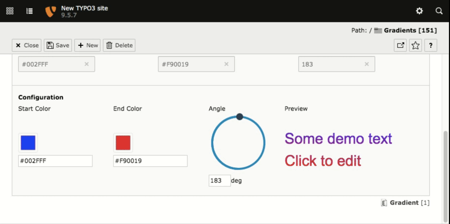

# [POC] Gradient Widget for TYPO3

This is a proof of concept on how to utilize Web Components via Vue.js to build modern widgets and input wizards for the TYPO3 backend.

TYPO3 ships with various wizards to enhance the backend editing, e.g. a [color picker](https://docs.typo3.org/typo3cms/TCAReference/latest/ColumnsConfig/Type/Input.html#properties-rendertype-colorpicker), but they only work for a single field. Combining multiple inputs is possible and often utilized for [google map wizards](http://xavier.perseguers.ch/en/tutorials/typo3/articles/google-map-in-tca.html), but the code to connect the backend and preview part often results in quite ugly php/html/js mixtures. 
One of the main problems is also to keep the values of a wizard / widget in sync with the input fields. Also the current code from TYPO3 core to update the input, if the color picker returns a value, does not trigger a change event on the input. Thus it is pretty much impossible to currently get some live preview without saving the value.

# In detail
What i had in mind when building this widget was to create a reusable widget/component, that features a live preview of the given input.

The following tools/steps/configs are involved:

* A custom rendertype to set the color and angle input fields to readonly. Don't confuse this with the regular "readOnly" flag from TCA, since this completely disables the input and no data will be transmitted to the DataHandler. This way, we can simply write back the data to the input and let TYPO3 handle the database.
* A custom rendertype for the widget of type "user", that is not saved to the database and only available in TCA. The rendertype is responsible for handing over the database inputs to the Web Component, setting up the RequireJS configuration for Vue.js and the widget, and loading the glue code that handles the change events from the widget to update the readonly input fields.
* [vue-circle-slider](https://devstark-com.github.io/vue-circle-slider-demo/) provides the widget for the angle selection
* [element-ui](https://element.eleme.io/#/en-US/component/color-picker) provides the widget for the color pickers
* [vue-custom-element](https://karol-f.github.io/vue-custom-element/) is used to create the resulting Vue.js Web Component
* The saved data is used with a DataProcessor for the CType header to generate inline css, but this can be totally customized via TypoScript or even moved to some other generator, if you want to set up the the rendering differently. 

*Enough with the long introduction, here is what it looks like*

# Building the widget
Enter Resources/JavaScript/GradientWidget, run `yarn install` and then `yarn build` to build and automatically copy the widget over to the Public directory.
`yarn serve` loads up a static demo page with the component, but not the glue code for handling TYPO3 input etc. Thus changes to the widget can be easily tested with live reloading etc.  
